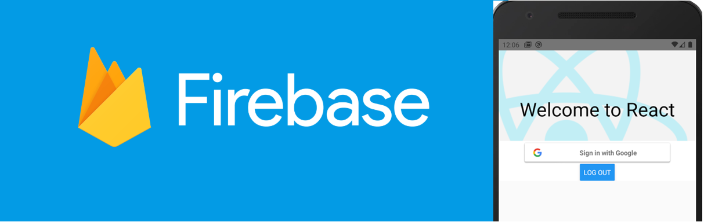

# React Native + Login Google + Firebase + Android
Olá pessoal, depois de ter muitos problemas para conseguir implementar no meu aplicativo, a funcionalidade de login utilizando o Google, salvando no Firebase, decidi criar esse tutorial.
Nas minhas pesquisas, encontrei muita infoormação pela metade, ou desatualizada. Além de disponibulizar os fontes, criei uma passo a passo sem erros. :)

**OBS: Este tutorial engloba apenas projetos a partir da versão 0.60 do RN(React Native) e o Android.**

1. **Criando Projeto React Native, add dependências e ajustando arquivos no projeto.**
   - **react-native init login_google_firebase_android**
   - **npm add firebase** dependência para o Firebase
   - **npm add @react-native-firebase/app**
   - **npm add @react-native-firebase/auth** dependência para o módulo Firebase Auth para RN
   - **npm add @react-native-community/google-signin** dependência do google signin para o RN
   - **react-native link @react-native-community/google-signin**  comando para você fazer o link da depenência do google signin, pois ainda não funciona com autolink. 

A partir daqui, se você fazer o build do seu projeto, ele não vai abrir, pois precisamos configurar algumas coisinhas para que a
lib(google-signin) funcione direitinho.

Precisamos acessar a pasta **android** dentro do projeto e abrir o arquivo **build.gradle** no seguinte caminho:
  **\login_google_firebase_android\android**

Dentro de **buildscript > ext** adicionar: **googlePlayServicesAuthVersion = "17.0.0"**

Dentro de **dependencies** adicionar o classpath: **classpath("com.google.gms:google-services:4.3.2")**

Deve ficar igual a imagem abaixo:

Agora vamos mexer em outro arquivo **build.gradle**, porém dentro da pasta app: **login_google_firebase_android\android\app**.
 - na parte de dependências vamos add as seguintes dependências:
   - **implementation project(':@react-native-community_google-signin')**
   - **implementation 'androidx.appcompat:appcompat:1.1.0-rc01'**
   - **implementation 'androidx.swiperefreshlayout:swiperefreshlayout:1.1.0-alpha02'**

Deve ficar igual a imagem abaixo:

2. **Abri o projeto no Android Studio**

Depois de abrir seu projeto no Android Studio, va para a aba **Gradle**, e selecione o arquivo **app/Tasks/android/signingReport**, igual a imagme abaixo:

Clique duas vezes em **signingReport** e após executado, **copie/salve a chave de “SHA1”**, ela será importante para os próximos passos. **Obs:** a chave em questão encontra-se na sessão do **“Task :app:signingReport”**, como a imagem mostra abaixo:

3. **Configurações no projeto no Firebase**

Acesse o console do seu **Firebase**, crie um projeto, caso não tenha. Feito isso, vamos criar um banco de dados.

Escolha o mode de teste: 

E clique em ativar. Próximo passo é adicionar um app Android. Na página inicial do projeto, vamos adicionar um app Android. 

Na tela de registrar app que abrirá, vamos preencher com os seguintes dados.
Nome do pacote do Android: esse nome desse ser exatamente o nome gerado automaticamente quando criamos o projeto. Você pode encontrar esse nome no arquivo **build.gradle** dentro da pasta **adroid/app**, é o mesmo arquivo que mexemos anteriormente.

Próximo campo é o Apelido do App, mas esse campo é opcional. Preencher o campo **“SHA-1”**, aqui vamos colocar a chave obtida no passo anterior.

E por último clicar no botão **“Registrar App”**.

Avance para o final, onde o Firebase verificará a instalação.

4. **Configuração do projeto no Google**

Nessa parte, vamos fazer a configuração do nosso projeto no Google. Basta acessar a seguinte página: 
<a href="https://developers.google.com/identity/sign-in/android/start-integrating" title="Title">Sign-in Google</a>

Rolar a página até a parte de configure um projeto:

Selecione o seu projeto: 

Vá para a próxima etapa, selecione Android e preencha as mesmas informações solicitada anteriormente: nome do pacote e chave SHA-1. 

Clique em **Create**.

Na imagem seguir, é dado seu **client id** e **chave secreta**, vão ser necessários para os passos seguintes. **Salve-os!!!**

**OBS:** se algum problema ocorrer nessa etapa, basta repetir o processo.

5. **Autenticação do Google no projeto no Firebase**

Volte a página inicial de seu projeto no Firebase, clique em **Authentication** no menu ao lado. Métodos de login e habilite o Google: 

Clique em configuração do SDK da Web e adicione seu client id e chave secreta, obtida anteriormente e clique em salvar.

Agora acesse as configurações do seu projeto, como mostra a imagem a seguir.

Em Apps para Android, selecione seu app e baixe seu arquivo **“google-services.json”**

Adicione este arquivo na pasta **“app”** que fica dentro da pasta **“android”**. Feito isto, rebuild seu projeto e inicie-o. Seu app estará configurado para fazer login Google.

Feito isso, agora precisamos adicionar um aplicativo web, o qual irá gerar um arquivo de configuração que utilizaremos no nosso código.

Utilizei o mesmo nome do nosso pacote, para o apelido do app. E para o campo código do aplicativo, vamos utilizar a chave cliente da web gerado anteriormente. 

Configuração gerada pelo Firebase. 

6. **Implementando botão Google o logica de acesso**

Vamos criar um componente que será responsável por toda a lógica de acesso.

Dentro de **“src\components”**, criei um componente chamada **LoginGoogle.js**.

Também vamos criar um arquivo **“config”**, onde vamos colocar o **“web cliente ID”** aquele mesmo configurado anteriormente no passo anterior. 

Outro arquivo de configuração que vamos criar é o **“firebaseConfig”**. Vamos criar ele na raiz do projeto e colocar as configuração obtidas no processo anterior. Veja a imagem: 

No nosso componente teremos basicamente o seguinte código:
Componente principal, ou seja o nosso App, vamos ter os seguintes importes.

**import * as firebase from 'firebase' 
import {firebaseConfig} from './firebaseConfig' 
firebase.initializeApp(firebaseConfig) 
import LoginGoogle from './src/componentes/LoginGoogle'** 

Observe que estamos apontando para o arquivo de configuração do Firebase que criamos. E o **importe** do nosso componente que iremos criar.

Criando o componente **LoginGoogle.js** e adicionando os importes necessários:

***import React, {Component} from 'react' 
import { StyleSheet, Button, View, Alert, } from 'react-native' 
import {GoogleSignin, GoogleSigninButton, statusCodes } from '@react-native-community/google-signin' 
import config from '../../config' 
import firebase from 'firebase' ***

Configuração inicial do Google, buscando nosso web cliente ID do arquivo de configuração.

***async componentDidMount() { 
        this._configureGoogleSignIn(); 
} ***

***_configureGoogleSignIn() {  
        GoogleSignin.configure({ 
          webClientId: config.webClientId, 
          offlineAccess: false, 
        }) 
} ***

Método responsável por fazer o login no Google

***_signIn = async () => { 
        try { 
          await GoogleSignin.hasPlayServices() 
          const userInfo = await GoogleSignin.signIn() 
          this.setState({userInfo, error: null}) 
          Alert.alert('Nome: ' + userInfo.user.name + 'Email: ' + userInfo.user.email) 
          this.onSignIn(userInfo)           
        } catch (error) { 
          if (error.code === statusCodes.SIGN_IN_CANCELLED) { 
            // sign in was cancelled 
            Alert.alert('cancelled') 
          } else if (error.code === statusCodes.IN_PROGRESS) { 
            // operation in progress already 
            Alert.alert('in progress') 
          } else if (error.code === statusCodes.PLAY_SERVICES_NOT_AVAILABLE) { 
            Alert.alert('play services not available or outdated') 
          } else { 
            Alert.alert('Something went wrong', error.toString()) 
            this.setState({ 
              error, 
            }) 
          } 
        } 
    }***

Método responsável por fazer o log off

***_signOut = async () => { 
        try { 
          await GoogleSignin.revokeAccess() 
          await GoogleSignin.signOut()     
          this.setState({userInfo: null, error: null}) 
          Alert.alert('Log out ok') 
        } catch (error) { 
          this.setState({ 
            error, 
          }) 
        } 
   } ***

E nosso botão no padrão do Google

Esses métodos são necessários para fazer o login no google e obter os dados na resposta.

Agora vejamos os métodos utilizados para gravar o usuário no Firebase. Para não ficar estranho de ver, colocarei uma image, porém vocês podem ter acesso aos métodos nos fontes. 

Feito isso podemos executar nosso App e testarmos.

Tela como o botão de login 

Autenticação do Google 

Dados retornados do Google 

Usuário salvo no Firebase 

7. **Conclusão**

Bom pessoal, acho que é isso!! 

Obviamente que a API do Google é muito mais complexa e disponibiliza muito mais opções. Porém, esse é o básico para conseguirmos 
fazer o login e obtermos um retorno.

Sei que são muitas etapas e configurações, por isso tentei deixar o mais claro possível. 
:)

Até uma próxima, abraços!!

